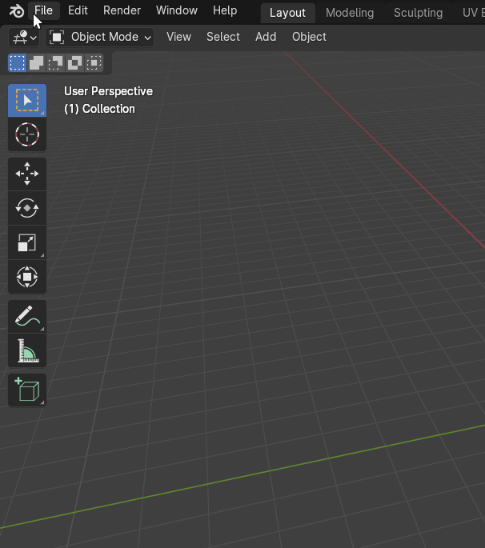
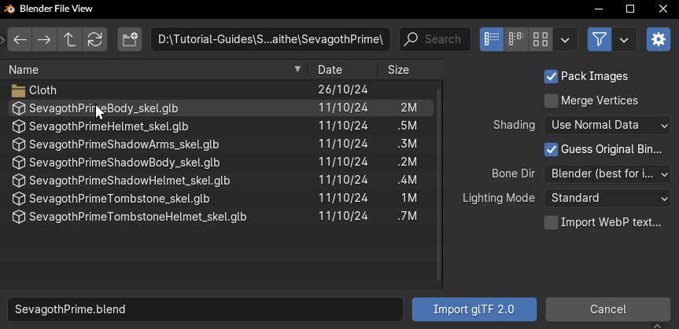
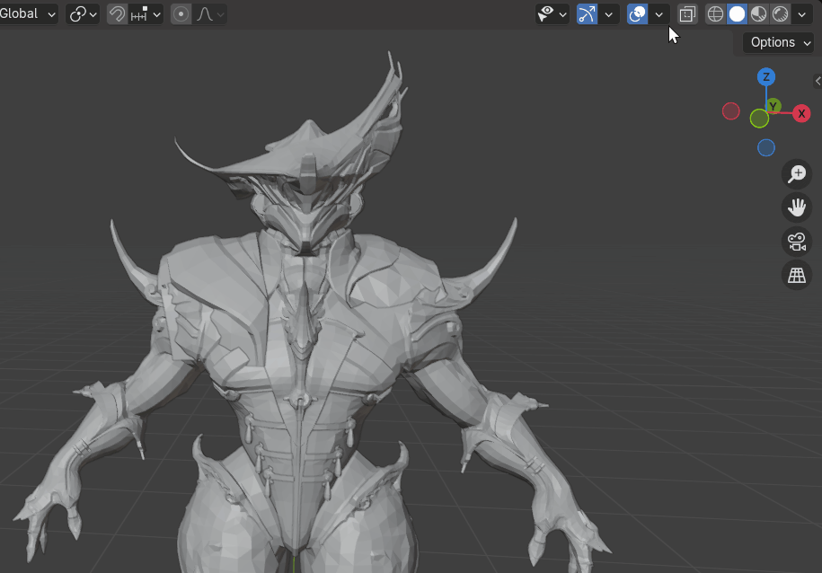
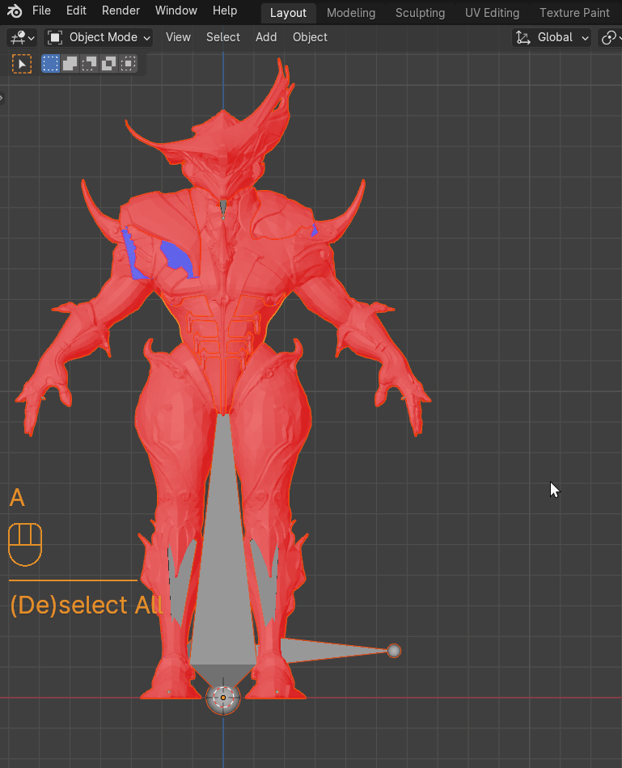
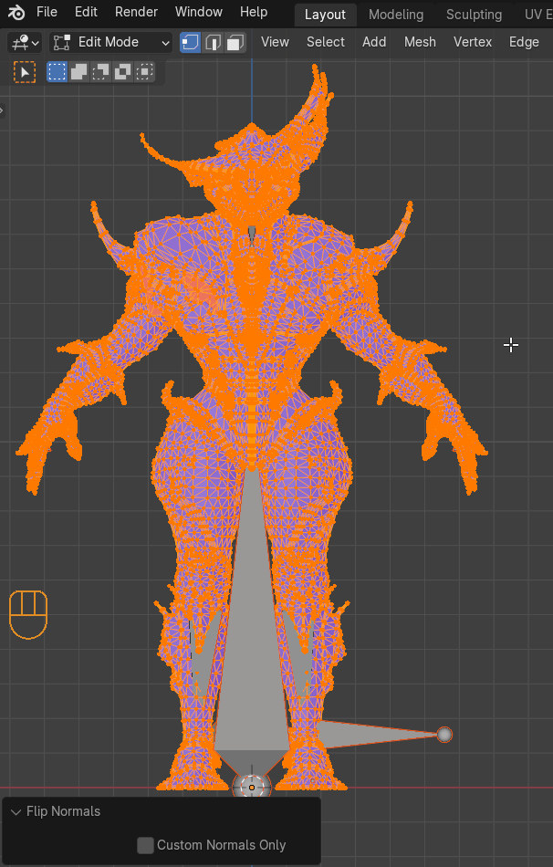
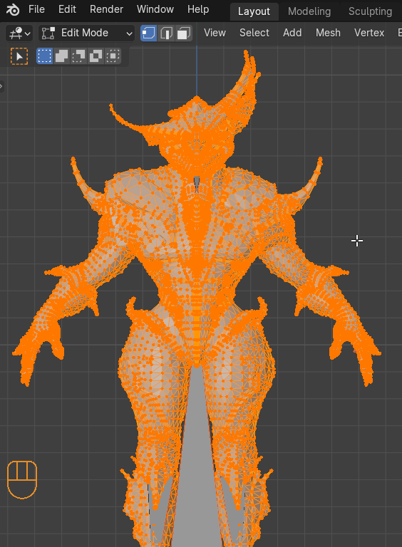
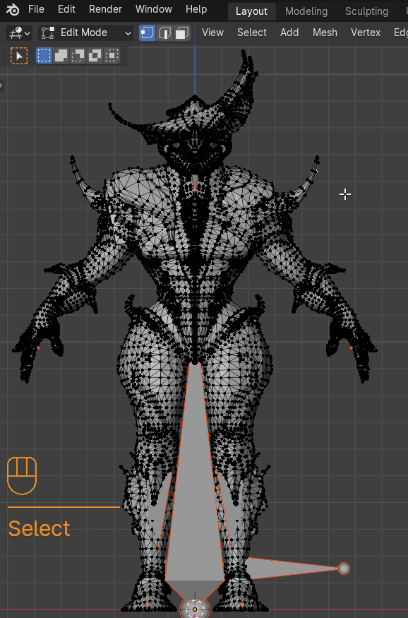
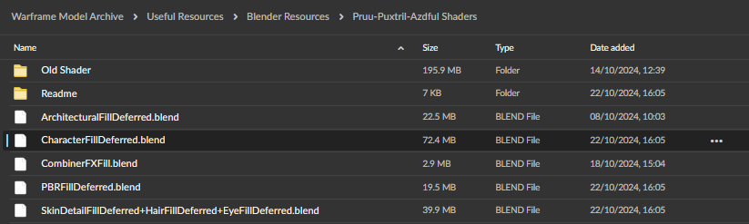

# Setting up Characters

To begin, ensure that you have the model, along with its textures and materials, extracted into a directory you're familiar with. For details on how to extract these files, refer to the [extractor](../extractor/extractor.md) documentation.

Make sure your Blender is up to date. [](https://www.blender.org/download/)

Step 1, Importing.  
File > Import > glTF 2.0


Find the files you extracted and import them with these specific settings.

- Make sure that Guess Original Bind Pose is **not** checked.
- Make sure that Bone Dir is set to Temperance (average).



Your blender should contain the model that you imported as well as the skeleton of that model.


Step 2, Import Clean-up.

As you can see here, when we enable the face orientation in the viewport overlays, the face orientation is flipped.



We need to flip these to be able to have our shader work correctly.  
To do this enter Edit Mode, Mesh > Normals > Flip, **or** press ++alt+n++ and then `Flip`.



- The face orientation overlay should be blue now.

Now we need to merge the vertices
To do so go to Mesh > Clean Up > Merge by Distance **or** ++m++ and choose `Merge by Distance`.

- Make Sure **not** to change the distance as you might remove parts of the actual geometry.



Because of the merge we need to reset the vectors.

To reset these enter Edit Mode, Mesh > Normals > Reset Vectors **or** press ++alt+n++ and choose `Reset Vectors`.



To make sure that the normal maps work correctly in the future, we need to smooth shade the mesh.  
To do this switch back to Object mode and click Object > Shade Smooth or Right Click and select Shade Smooth.



Step 3, Shaders

For this step, make sure you have extracted the material .txt files and textures for the model, these textures should be a format supported by blender, for example .png or .tga , but **not** .dds. You can find instructions on extracting textures on the [extractor](../extractor/extractor.md) page.

- In this guide we are using and explaining the Pruu shaders.

Shaders Overview

Characters use three primary shaders, not including glass or FX-related shaders.

To view the shader details, open the material .txt file and scroll down to the section titled:

```
####################
#   Shader Set 1   #
####################
```

Locate the first shader referenced in the material .txt, which should look like this:

```
2: /EE/Shaders/Deferred/CharacterFillDeferred.hlsl
```

This material specifically uses the **CharacterFillDeferred** shader.

Other shader types, such as those used for hair or skin, will be covered in separate sections.

Locating and Importing the Shader from Blender

To find the Blender file containing the relevant shader, open the mega archive and navigate to:

```
Warframe Model Archive > Useful Resources > Blender Resources > Pruu-Puxtril-Azdful Shaders
```



Download the file with the shader name.
!!! note
It’s a good idea to open the file now and read the included README to get an understanding of the shader and any potential caveats that might appear regarding its usage.  
Once you're done, close the file and return to the model you're working on.

Follow these steps to add the shader to your scene:

1. Go to **File > Append**.
2. Select the **CharacterFillDeferred.blend** file you just downloaded.
3. Navigate to **Materials** and choose the material that fits the description (for example, Garuda or Khora).

Be aware that Blender may freeze during this process, and the duration can vary from nearly instantaneous to several minutes depending on your hardware. Visually, no changes will appear immediately.

Applying and Renaming the Shader in Blender

1. Switch to the **Shading** tab and select any mesh.
2. In the shading panel, you will see the material currently applied to the selected mesh.
3. Click on the arrow next to the material's name, and from the dropdown list, select the material you appended earlier.

Blender will likely freeze for a longer period than before. Once it responds, the shader will be applied to the mesh, but the name will be incorrect since the shader was originally designed for a different mesh with a different name.

To resolve this, you have two options:

Option 1: Copy and Paste the Shader Data

1. In the **Shading** tab, press **A** (to select all shader nodes), then press **Ctrl + C** (to copy).
2. Switch the material back to the one that was originally assigned to the mesh.
3. Press **A** again (to select all nodes in the current material), then press **Del** (to delete them).
4. Finally, press **Ctrl + V** (to paste the shader data).

Option 2: Rename the Material

1. Click on the material's name and rename it to the one you want to use.
   - Note: The names must be unique. If a name conflict occurs, Blender will automatically append `.001` to the duplicate name.

Option 3: You can ignore it if it does not affect your workflow.

Inputting the Textures into the Shader

1. In the material file, locate all the textures referenced for the shader.
2. In the **Shading** tab, drag and drop each texture file into the shader editor one by one.
3. Make sure that the colour space is set to **Non-Colour**

- Textures can be easily set up by simply replacing the corresponding textures

  - e.g. khoraDeluxePackPap -> GaussPrimeBodyPackMap

- Typically, the textures are stored in the same folder as the mesh or material file.
- However, microdetails (such as specific fine textures) may be located in separate folders, as specified in the material file.

Make sure to connect the textures properly in the shader to ensure they are applied correctly.

Setting the correct shader values
now copy values from material file and replace existing ones under same name in shader

-cloth rigs positioned step-
)apply constraints on cloth rigs  
)select everything  
)alt-p  
)keep offset  
)Select 1 cloth rig  
)go edit mode  
)select all chains of bones except very first bone in the chain with holding shift  
)click on any bone in the so its yellow instead of orange  
)go to relation tab on the right in bone properties  
)while holding alf click on 'connected'  
)go pose mode(can do in edit too but can sometimes fuck up naming)  
)select 1(one) first bone from any chain(dont be dumb and select outer or inner one from side)  
)press ctrl-l  
)Press f3  
)write batch rename  
)click on it  
)switch to bones, selected only, new name or something(should look up - dont remember names)  
)write any name you like. Sevagoth_prime_cloth.L  
)hit enter  
)repeat the process for other chains until done  
)if have left and right side then name one side with .L other with .R  
)repeat the process with all other cloth rigs  
)dont give same names to different rigs, make unique ones  
Cloth1.l  
Cloth2.l  
Cloth3.l...  
)append basic rig collection or whatever rig is from .blend  
)unhide metarig  
)select all cloth rigs and then metarig and join them together. Metarig should be selected last  
)if everything done right can change target of armature mod to metarig(for cloth mesh) and it will work as it did before  
-if have mathing L and R 2 cloth rigs that were joined  
)go edit mode on metarig  
)select one side of the rig  
)make sure mirroring is enabled  
)click g/s/r(one of the 3) and then enter  
-regardless of this step above  
)go edit mode on metarig.  
)select root bone from cloth rig(that was merged with metarig)  
)Select bone from metarig that cloth rig was snapped to  
-if you hold alt you can pick which bone you are selecting when there are many if them  
)press ctrl-p and with keep offset  
)select root bone and all bones that were with root like clothbone2145(they are in same position as root bone and bone you parented to) and delete them  
)repeat this step for all root bones added  
)select bone chains you want to add to a collection like 'helmet', 'body'.  
)Press M. Select new collection and write name.  
)repeat this step until all cloth bones are accounted for  
)go pose mode  
)select first bone in the chain like before.  
)In bone properties tab scroll down to rigify tab  
)assign preffered rig type  
)usually its super_copy. Can assign shape after this step  
)select all other first bones in other chains then this bone you gave rig type  
)press f3  
)write copy type  
)select copy rig type to selected  
)Press H to hide them from view  
)select first bones again and give them some other type. Stretchy chain or spline tentacle if there are many bones.  
(What each type does and when to use will cover later)  
)repeat step with copy type to selected  
)switch to armature properties  
)scroll down to UI widget  
)assign slots to collections  
)can assign colors too. Its tab above this one  
)click regenerate  
)for all cloth meshes change armature target to generated rig  
)move rig in pose mode, check if all added bone collections move/work as intended  
)if everything works then move rig in pose mode to side by moving root bone  
)go to scripting tab  
)append 'def add' text  
)Select it in text tab  
)select cloth mesh and run script  
)if everything done right then it will either filly or almost fully snap to moved to the side rig  
)repeat for all meshes  
)switch tabs back  
)select rig  
)in collections tab on the right select star ✨ button for DEF layer  
)Find main bone name that cloth bones are parented to  
)copy that name  
)select cloth mesh that moved almost fully.  
)In vertex groups search for ROOT group  
)rename that to the name you copied  
)repeat this for every cloth mesh  
)congrats
