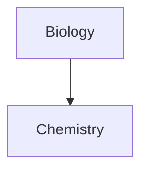

# This is heading 1  
## This is heading 2  
### This is heading 3  
#### This is heading 4  
##### This is heading 5  
###### This is heading 6  
___
### Tables & Formatting  

| Style                  | Syntax                 | Example                                  | Output                                 |     |
| ---------------------- | ---------------------- | ---------------------------------------- | -------------------------------------- | --- |
| Bold                   | `** **` or `__ __`     | `**Bold text**`                          | **Bold text**                          |     |
| Italic                 | `* *` or `_ _`         | `*Italic text*`                          | _Italic text_                          |     |
| Strikethrough          | `~~ ~~`                | `~~Striked out text~~`                   | ~~Striked out text~~                   |     |
| Highlight              | `== ==`                | `==Highlighted text==`                   | ==Highlighted text==                   |     |
| Bold and nested italic | `** **` and `_ _`      | `**Bold text and _nested italic_ text**` | **Bold text and _nested italic_ text** |     |
| Bold and italic        | `*** ***` or `___ ___` | `***Bold and italic text***`             | **_Bold and italic text_**             |     |
___
### Links  
Internal: [Contributing](../contributing.md)  
External: [Obsidian Help](https://help.obsidian.md)  
Images:  
  { width="65%" }  

___
### Quotes

> Human beings face ever more complex and urgent problems, and their effectiveness in dealing with these problems is a matter that is critical to the stability and continued progress of society.

\- Doug Engelbart, 1961  


???+ note "Are admonitions foldable?"
	Yes! In a foldable callout, the contents are hidden when the callout is collapsed.  
___
### Lists  
#### Bulleted Lists  
- First list item  
- Second list item  
- Third list item  

#### Nummered Lists  
1. First list item  
2. Second list item  
3. Third list item  

#### Task Lists  
- [x] This is a completed task.  
- [ ] This is an incomplete task.  

#### Nested Lists  
1. First list item  
   1. Ordered nested list item  
2. Second list item  
   - Unordered nested list item  

#### Nested Task Lists  
- [ ] Task item 1  
	- [ ] Subtask 1  
- [ ] Task item 2  
	- [ ] Subtask 1  

#### AnuPpuccin Checkboxes  
- [ ] Unchecked  
- [x] Checked  
- [>] Rescheduled  
- [<] Scheduled  
- [!] Important  
- [-] Cancelled  
- [/] In Progress  
- [?] Question  
- [*] Star  
- [n] Note  
- [l] Location  
- [i] Information  
- [I] Idea  
- [S] Amount  
- [p] Pro  
- [c] Con  
- [b] Bookmark  
- ["] Quote  
- [u] Up  
- [d] Down  
- [w] Win  
- [k] Key  
- [f] Fire  
- [0] Speech bubble 0  
- [1] Speech bubble 1  
- [2] Speech bubble 2  
- [3] Speech bubble 3  
- [4] Speech bubble 4  
- [5] Speech bubble 5  
- [6] Speech bubble 6  
- [7] Speech bubble 7  
- [8] Speech bubble 8  
- [9] Speech bubble 9  


___
### Horizontal Rules  
___
```md
***
****
* * *
---
----
- - -
___
____
_ _ _
```
---
### Codeblocks  

#### Inline Code  
Text inside `backticks` on a line will be formatted like code.  
If you want to put backticks in an inline code block, surround it with double backticks like so: inline ``code with a backtick ` inside``.  

#### CodeBlocks  

```js
function fancyAlert(arg) {
  if(arg) {
    $.facebox({div:'#foo'})
  }
}
```

___
### Mermaid 



### help.obsidian.md markdown
| Syntax          | Description                                                                                                   |
| --------------- | ------------------------------------------------------------------------------------------------------------- |
| `[[Link]]`      | [Internal links](https://help.obsidian.md/Linking+notes+and+files/Internal+links)                             |
| `![[Link]]`     | [Embed files](https://help.obsidian.md/Linking+notes+and+files/Embed+files)                                   |
| `![[Link#^id]]` | [Block references](https://help.obsidian.md/Linking+notes+and+files/Internal+links#Link to a block in a note) |
| `^id`           | [Defining a block](https://help.obsidian.md/Linking+notes+and+files/Internal+links#Link to a block in a note) |
| `%%Text%%`      | [Comments](https://help.obsidian.md/Editing+and+formatting/Basic+formatting+syntax#Comments)                  |
| `~~Text~~`      | [Strikethroughs](https://help.obsidian.md/Editing+and+formatting/Basic+formatting+syntax#Styling text)        |
| `==Text==`      | [Highlights](https://help.obsidian.md/Editing+and+formatting/Basic+formatting+syntax#Styling text)            |
| ` ``` `         | [Code blocks](https://help.obsidian.md/Editing+and+formatting/Basic+formatting+syntax#Code blocks)            |
| `- [ ]`         | [Incomplete task](https://help.obsidian.md/Editing+and+formatting/Basic+formatting+syntax#Task lists)         |
| `- [x]`         | [Completed task](https://help.obsidian.md/Editing+and+formatting/Basic+formatting+syntax#Task lists)          |
| `> [!note]`     | [Callouts](https://help.obsidian.md/Editing+and+formatting/Callouts)                                          |
| (see link)      | [Tables](https://help.obsidian.md/Editing+and+formatting/Advanced+formatting+syntax#Tables)                   |