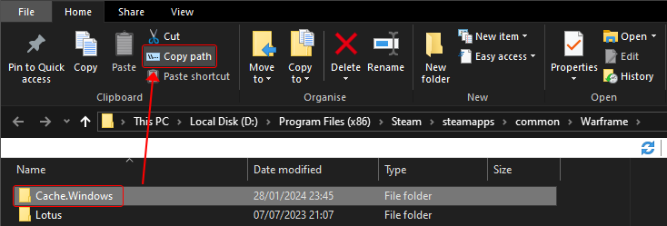

# Using The Extractor
??? youtube "Video Explanation"  
	<iframe width="752" height="423" src="https://www.youtube.com/embed/71fCaIE7J_4?si=8DUQ0K3U-Ds-8uUN" title="YouTube video player" frameborder="0" allow="accelerometer; autoplay; clipboard-write; encrypted-media; gyroscope; picture-in-picture; web-share" allowfullscreen></iframe>

## Getting Started  

### Basic command line concepts  

- Every action is performed by commands.  
- You can use ++tab++ to autocomplete.  
- Basic commands to help you get acquainted with the command line:  
	- use `ls` to list directories.  
	- use `cd` to change directories.  
	- `.\` is used for the current directory.  
	- When using a program you use arguments in the form of  `--argument`.  
- The internal file structure of warframe can be thought of like a Unix system that uses `/` instead of `\` to denote its directories.  

### Downloading the Extractor  

Firstly head over to the releases page for the [Extractor](https://github.com/Puxtril/Warframe-Exporter/releases/latest) on GitHub and download the file called `Warframe-Exporter.exe`.  

Secondly create a folder for the extractor as well as the files it will be extracting and then put  `Warframe-Exporter.exe` inside that folder.  

## Using the Extractor 
Now we want to navigate to that folder, you can either do it yourself in the terminal or follow this process to do it easily. 
Inside the folder that you have the Extractor in, hold ++shift++ and then right click, this should bring up the context menu with the option to open in Powershell.  
	- **Make Sure not to have anything selected when doing this.**  
	  

Once you are in the terminal type `.\Warframe-Exporter.exe --version` to make sure that you are in the right directory and it works.  


Next you need to find where your warframe cache is stored, this will be in the same folder that you installed warframe in.  
	- If you installed with steam click browse local files to find your installation.  
		    
     
You then want to select the folder called `Cache.Windows` and click `Copy Path` up in the ribbon above.  
  
You want to paste this  somewhere you can easily access it, as it is needed for all of the commands in the extractor.     


To get started take a look at the help page to get youself familiarised with all of the commands that can be run by using `.\Warframe-Exporter.exe --help`, open the dropdown below for what would get output on the extractor version 2.5.1.  

??? abstract "Terminal Output"  
    ```powershell
    > .\warframe-Exporter.exe --help

    For an introduction into...
     - How to use this tool
     - Why it's necessary to use this instead of Ninjaripper
     - How to handle the output of this program

    Please review this guide
    https://docs.google.com/document/d/1ZzQ71NH2dVp7S-1fMUmVTezXFAKWgFRf0RodDqS6rUg

    ------------------------------------------------------------------------------
    All options:

       --internal-path <Internal Path>
         Internal path base. Ex: /Lotus/Characters/Tenno/Excalibur

       --package <Package name>
         Warframe package. Ex: "Misc" or "Texture"

       --cache-dir <Cache.Windows path>
         (required) Cache directory. Ex: C:\Program
         Files\Steam\steamapps\common\Warframe\Cache.Windows

       --output-path <Output path>
         Destination of extracted assets. Ex:
         C:\Users\Puxtril\Downloads\Extracted (Default: Current directory)

       --vertex-colors
         Include extraction of Vertex Colors

       One of:
          --extract-textures
            Extract all textures

          --extract-models
            Extract all 3D models

          --extract-materials
            Extract material metadata

          --extract-levels
            Extract all levels

          --extract-audio
            Extract audio clips

          --extract-all
            Extract all resources

          --ls
            List contents of directory

       --,  --ignore_rest
         Ignores the rest of the labeled arguments following this flag.

       --version
         Displays version information and exits.

       -h,  --help
         Displays usage information and exits.

       https://github.com/Puxtril/Warframe-Exporter

    ```

### Creating your command  
Now we want to put our command together and extract our models.  
	For this example we will be extracting Excalibur.  

```powershell
.\Warframe-Exporter.exe --extract-models --package Misc --cache-dir 'C:\Program Files (x86)\Steam\steamapps\common\Warframe\Cache.Windows' --internal-path /Lotus/Characters/Tenno/Excalibur --output-path .\Excal  
```  

- `.\Warframe-Exporter.exe` Is just the program.  

- `--extract-models` Tells the program to extract models.   

- `--package Misc` Tells the program to extract from the Misc package, this package is the one that holds the materials and models. 

- `--cache-dir` Should be followed by the path that we copied earlier.  

- `--internal-path` Tells the program which internal path to extract from, in our case this is the directory that all of the Excalibur files are stored in.  To get a grasp of the internal file structure I recommend looking at the [Directory Layout](./file-list.md) page, or using the `--ls` command to look through all of the directories.  

- `--output-path` This is the path that the extractor will extract to, if this is left empty it will output the files to the same folder that the exporter is in under a folder called `Extracted`.  

We still need to extract the textures and materials for Excalibur.  
So we want to either scroll up in the terminal history and copy and paste the command again or you can press ++arrow-up++ to get the command again.  

Next we want to use the ++arrow-left+arrow-right++ arrows to move the cursor to where `--extract-models` is and then change that to `--extract-materials` and run the command again.  

- This will extract the material .txt files so that we are able to set up the shader correctly later.  

After that is completed we want to bring up the command again and replace `--extract-models` with  `--extract-textures`, then we want to move over to the package and change `Misc` to `Texture` and run the command again.  

- This will extract the .dds texture files.  

- If you want to you can use some of the scripts and tools linked on the [Useful Tools](./tools.md) page to convert these textures to a more usable format.  
Now you can navigate to the directory that you exported to and it will have all of the files needed for [Character Setup](../models/character-setup.md) 

### Common Extractor commands
These are some common commands premade so you can copy and paste them into your terminal.  

Models  
```powershell
.\Warframe-Exporter.exe --extract-models --package Misc --cache-dir 'CHANGE THIS' --internal-path /Input_Your_Desired_Path
```  

Textures  
```powershell
.\Warframe-Exporter.exe --extract-textures --package Texture --cache-dir 'CHANGE THIS' --internal-path /Input_Your_Desired_Path
```  

Materials  
```powershell
.\Warframe-Exporter.exe --extract-materials --package Misc --cache-dir 'CHANGE THIS' --internal-path /Input_Your_Desired_Path
```  
## Other Formats
The extractor can extract other things from the files such as levels and audio.  

An example level extract command.  
```powershell
.\warframe-Exporter.exe --extract-levels --cache-dir 'D:\Program Files (x86)\Steam\steamapps\common\Warframe\Cache.Windows' --internal-path 
Lotus/Levels/PVP --output-path .\PVP
```  

This will extract all of the conclave levels with all of the models assembled inside of one file, textures and materials however must be exported from other directories based on the name of the material on the individual objects inside the file.  
This page explains how to set up levels in blender [Level Setup](../models/level-setup.md).  

An example sound extract command.  
```powershell
.\warframe-Exporter.exe --extract-audio --cache-dir 'D:\Program Files (x86)\Steam\steamapps\common\Warframe\Cache.Windows' --internal-path 
Lotus/Music/Cinematics/Tempestarii --output-path .\Sounds
```  

This will extract the music from the Tempestarii quest in the .ogg format.  

<!--
1. Download the latest Extractor release from the github page.

2. Inside the folder you downloaded it to, SHIFT + Right click and press Open CMD here or Open Powershell here. It doesn’t matter which.

3. Type in “.\”, the name of the executable, and the command you want to execute. Examples below. You can always type .\Warframe-Extractor.exe –help for a full list of options.
Models: .\Warframe-Extractor.exe –cache-dir C:\<Path-to-Warframe-Cache.Windows> –extract-models
.\Warframe-Extractor.exe –cache-dir C:\<Path-to-Warframe-Cache.Windows> –extract-textures
-->