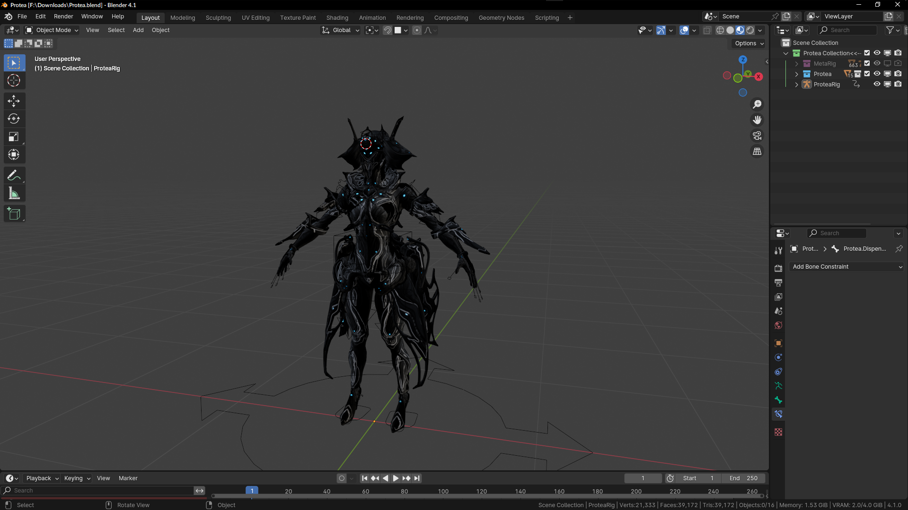
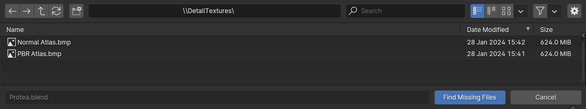
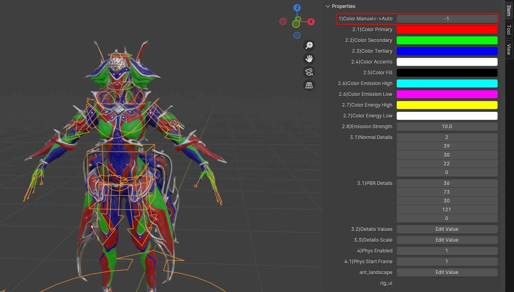
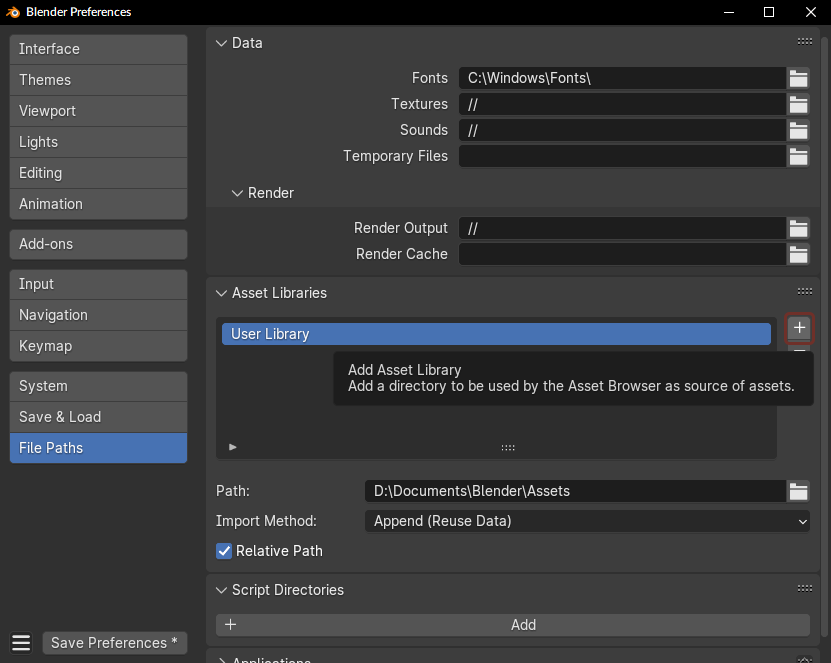

# Frequently Asked Questions 

### Q: My Blender crashes when I try to open the file 

Try updating your Blender version.  
Most models have been updated to:  

### Q: Where do I download models  

The Mega Archive linked all over the place and [Here](https://mega.nz/folder/fIUQDQYZ#vRNqurxNdzELIboK214Kxg).  
If you are struggling to find a warframe use the search function.  
  

### Q: The skin that I want to use is not in the archive  

It will be inside the **Warframe**.blend, you just have to change skins  
Before 4.1 there is a skin select custom property in the properties panel.  
After 4.1 you select the skin by using the checkbox in the outliner.  

### Q: I cant extract the *Warframe*(Pruu).rar  

Use a program like [7zip](https://7-zip.org/) to extract it.  

### Q: The Warframe that I want to use is not in the archive  

If it is a prime warframe you are looking for it will be in the normal warframes .blend.  
If it is a skin or a warframe from some of the latest updates it might not be set up yet. (There are very few people who actually set stuff up.)  

### Q: I opened *Warframe*(Pruu).blend and it looks terrible  

For Example:  
  
This is because the DetailTextures atlas is not loaded.  

To fix this you want to go to the mega and download the "(Required) DetailTextures (New).rar" file,  
Extract it somwhere that you will remember, and then head back to blender.  

Now we want to go and find missing textures.  
  

Now we want to go to the path we extracted the DetailTextures to and then we want to click find missing files.  
  

Now your warframe should look like this:  
  

### Q: How do I change colours  

To change the colours of your warframe you can either pick between the defaults for each frame or chose to use custom ones.  
Default colours will be 0-9 or more and custom will be -1.  
To find the custom property you need to select the armature and then open the properties panel.  
  

To change from defaults to custom change it to -1.  
  

### 

### 

### Q: Is *Warframe* ripped?  

That depends, if you want the raw files, then yes most warframes are ripped and people will usually be happy to send you the raw files.  
However if you mean *Set Up*, check the mega or the resource forum, if it is not there it is most probably not set up for blender.

### Q: How do I set up *Warframe*/*Weapon*/*Level*?  

There are some sparse guides currently being worked on here with information on the process.  
For [Warframes](models/character-setup.md)  
For [Weapons](models/weapon-setup.md)  
For [Levels](models/level-setup.md) 

### 

### How to add Asset Libraries 
Asset Libraries are used to make the process of using level files a lot simpler and less space consuming.
To use the AL you want to download all of the ones you will need from the mega and put them in their own folder, then you want to add them in blender by following these steps.  

1. you want to add a new asset library.  
	  

2. You want to go to the folder that your Asset Libraries are stored in.  
	  

3. You want to make sure that the import method is set to link.  
	

### Q: How do I use Blender  
[https://www.youtube.com/results?search_query=blender+tutorial](https://www.youtube.com/results?search_query=blender+tutorial)