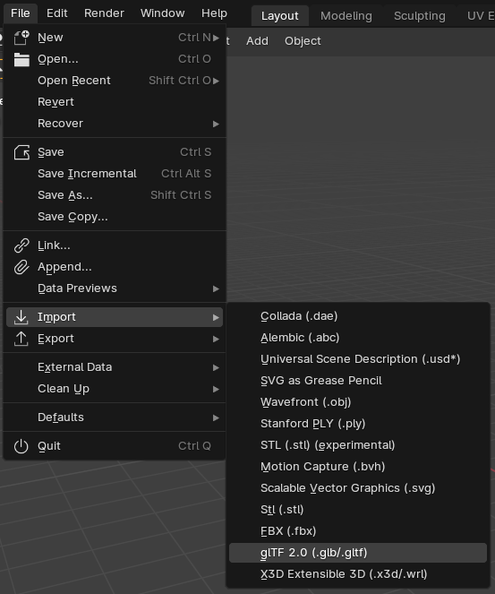
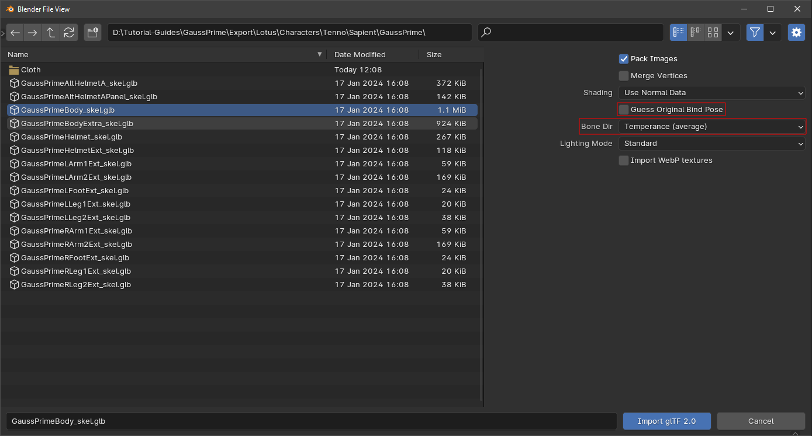
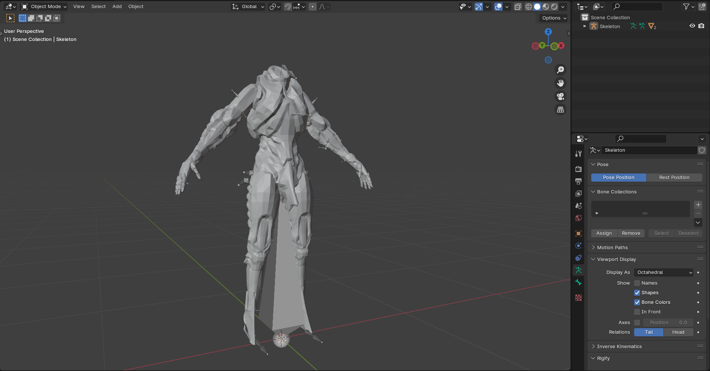
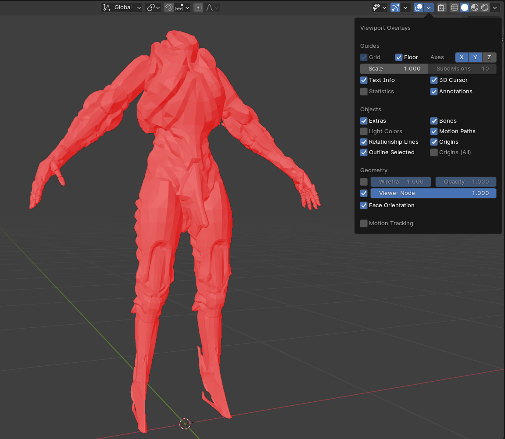
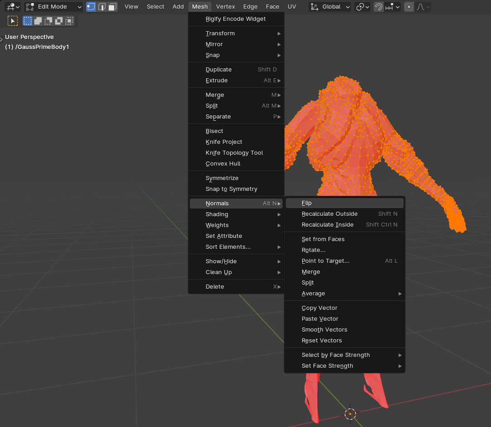
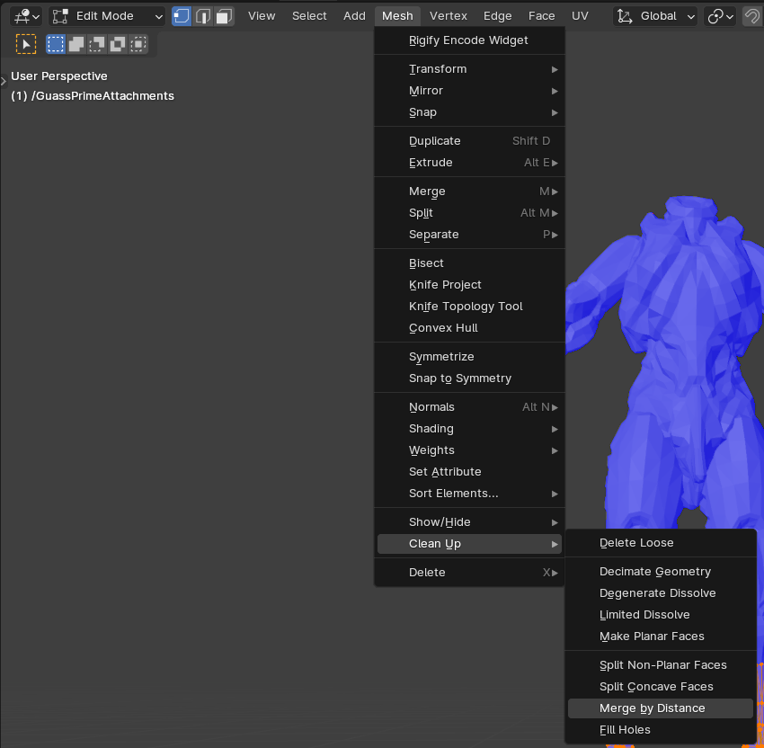
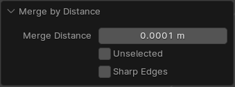
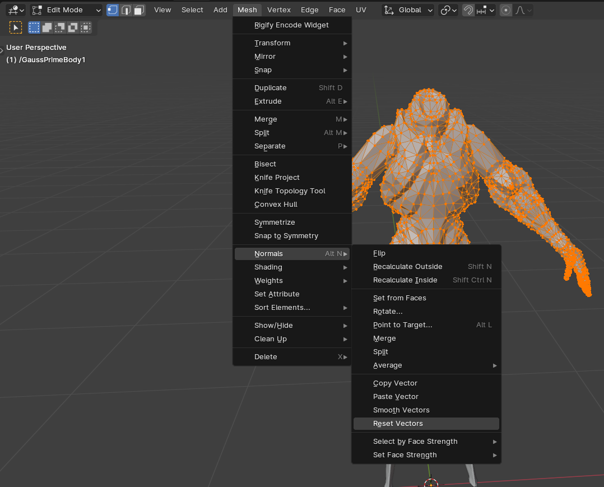
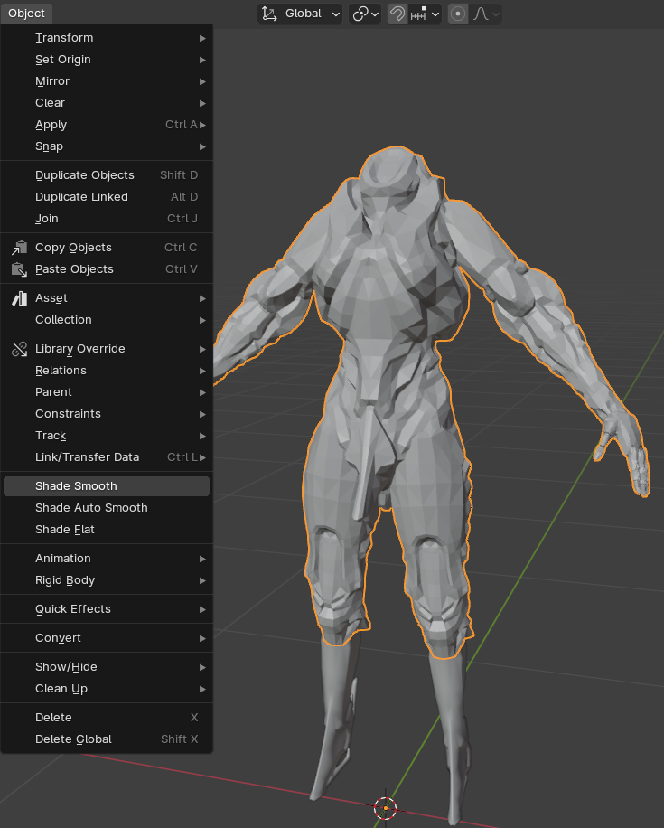

# Setting up models
To get started you will want to have a model, its textures and its material extracted in a directory you know.  
For information on extracting read through the [extractor](extractor.md) page.  
## Process  
This process was done on the 4.0.2 build of blender, however it is recommended to always use the latest build.  
This example will use Gauss Prime
### Importing  
##### Step 1.  Import
###### 1.1 glTF
Import .glb  
  
###### 1.2  Import Settings  
Find the files you extracted and import with these settings  
- Make sure that Guess Original Bind Pose is not checked  
- Make sure that Bone Dir is set to Temperance (average)  

  
Your blender should look like this.  
  
##### Step 2. Import Cleanup  
###### 2.1 Normals
As you can see, the normals/face orientation is flipped.  
  
To flip these enter Edit Mode, Mesh -> Normals -> Flip or press ++alt+n++ and then Flip.  
  
- They should now be blue. 
###### 2.2 Merge  
Not all models need it but it is best practice to merge by distance each mesh.
To do so go to Mesh -> Clean Up -> Merge by Distance or ++m++ and choose Merge by Distance.  
  
Make Sure not to go any higher than this as you might remove parts of the actual geometry    
###### 2.3 Vector  
Because of the merge we need to reset the vectors.
To reset these enter Edit Mode, Mesh -> Normals -> Reset Vectors or press ++alt+n++ and then Reset Vectors.  
  
###### 2.4 Shading
For the normal maps to work in future we need to set the mesh to shade smooth.
To do this go back to Object mode and click Object -> Shade Smooth or Right Click and select Shade Smooth.  
  
##### Step 3. Shader
It is advised to make sure you have the material .txts and a texture format other than .dds details on how to convert on the [extractor](extractor.md) page.  
###### 3.1 Shader Generation  
First you will need to determine the shader generation, this is detailed in the [shader](shader.md) page.  
The shader gauss uses is G3.  
###### 3.2 Adding Shader  
As the GaussPrimeBody.txt has `AO_FROM_DETAILS_BLUE` we can look in the G123 Split Shader.blend and see that the material under `AO_FROM_DETAILS_BLUE in Txt` is the `H_Khora_Deluxe` one.  
First, append the `H_Khora_Deluxe` material
Next, copy the name of the original material